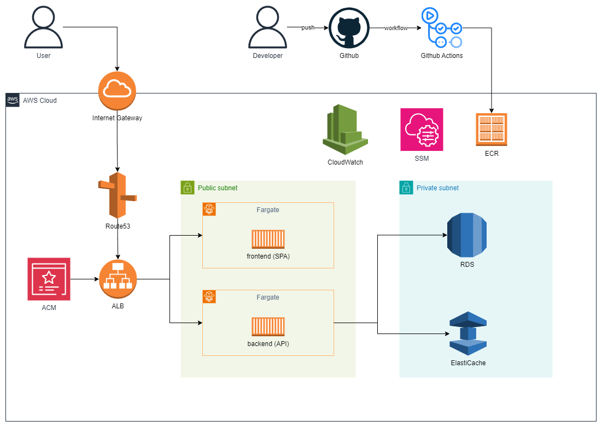

# techbranch-infra

## 使用技術

<p>


</p>

## セットアップ

### SSM でのパラメータの設定

必要な設定値(データベースパスワード、API キーなど)を AWS Systems Manager Parameter Store に事前に設定してください。

| パラメータ                             | 概要                                              |
| -------------------------------------- | ------------------------------------------------- |
| /techbranch/database_name              | DB 名                                             |
| /techbranch/database_password          | DB パスワード                                     |
| /techbranch/database_user              | DB ユーザ名                                       |
| /techbranch/gmail_from                 | 仮登録メール送信用の Gmail の送信元メールアドレス |
| /techbranch/gmail_password             | 仮登録メール送信用の Gmail のパスワード           |
| /techbranch/jwt_secret                 | JWT のシークレットキー                            |
| /techbranch/oauth_google_client_id     | Google 認証に使用するクライアント ID              |
| /techbranch/oauth_google_client_secret | Google 認証に使用するクライアントシークレット     |
| /techbranch/oauth_google_redirect_url  | Google 認証時のリダイレクト URL                   |
| /techbranch/oauth_google_state         | Google 認証に使用する state                       |
| /techbranch/signup_url                 | サインアップの URL                                |

### デプロイ

次のコマンドを実行します。

```bash:
$ terraform init
$ terraform apply
```

## クリーンアップ

次のコマンドで作成したリソースをすべて削除できます。

```bash:
$ terraform destroy
```

## 構成図

